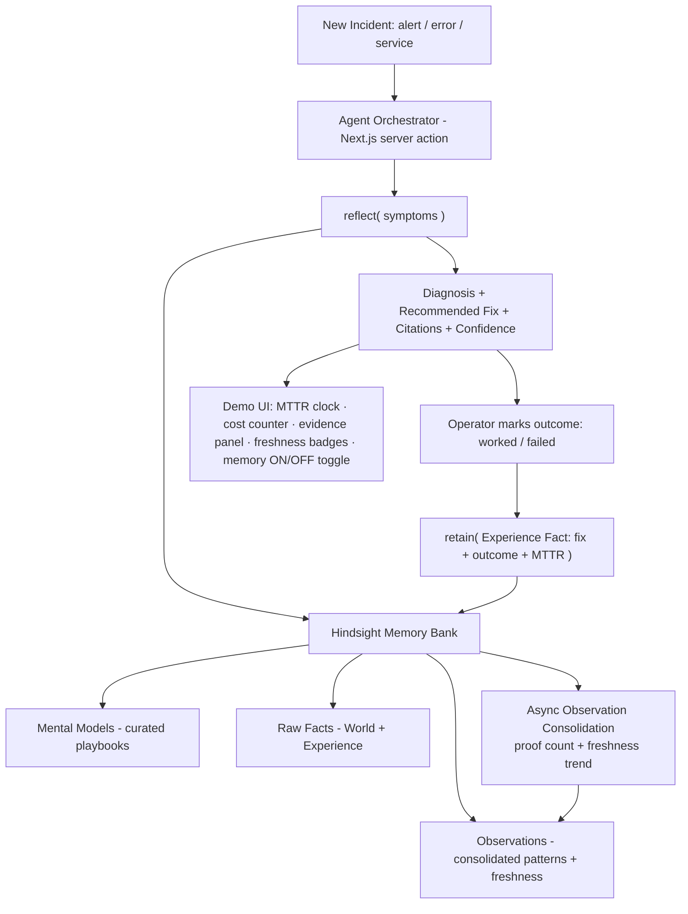

# Aftermath — The On-Call Agent That Learns From Every Outage

**HackVadodara '26 · Community Edition · Problem Statement 5 (Incident Response Agent)**
**8-hour sprint · Built on Hindsight (required) · Working codename: _Aftermath_ (rename freely)**

> One-liner for judges: *"Most incident tools search old postmortems. Aftermath learns from them — it remembers every outage it has resolved, distills reusable mitigations, notices when a fix stops working, and gets measurably faster at diagnosis with every incident. Memory isn't a feature here. It's the product."*

---

## 1. What We're Solving

When a system breaks at 3am, the on-call engineer is usually solving a problem the team has *already solved before* — but the knowledge is scattered across old Slack threads, half-written postmortems, and the heads of whoever was on-call last time. So Mean Time To Resolution (MTTR) stays high, the same root causes recur, and hard-won lessons evaporate.

The cost is concrete and translatable for any judge: **downtime is money.** A recurring outage that takes 4 hours to diagnose the first time should take 4 minutes the tenth time — *if* the system actually remembered. Today it doesn't.

**The gap:** existing tools retrieve past incidents (RAG). They do not *learn* from them. They cannot tell you a mitigation is decaying, cannot avoid a fix that backfired last month, and do not get smarter over time.

---

## 2. Problem Statement (Official + Sharpened)

**Official PS5 — Incident Response Agent:** Build an AI agent that remembers past incidents, root causes, mitigation strategies, and resolution processes, and leverages previous experience to recommend solutions when similar incidents recur. The value must come from cumulative learning, not one-time analysis.

**Our sharpening:** We don't just recall incidents — we run a closed learning loop. Every resolution (success *and* failure) is fed back into memory, consolidated into evidence-grounded patterns, and used to make the next diagnosis faster and more confident. The agent visibly improves during the demo itself.

---

## 3. Solution

Aftermath is an on-call SRE assistant with persistent, self-improving memory. For each incident it:

1. **Ingests** the symptom (alert text, error, affected service).
2. **Reflects** over its incident memory to propose a likely root cause and a recommended, *evidence-cited* mitigation — with a real confidence score.
3. **Captures the outcome** (the fix worked / failed) and writes it back to memory.
4. **Consolidates** that outcome into long-term patterns, so the next similar incident is resolved faster.

The result: a generic assistant on Incident #1, a sharp domain expert by Incident #10 — and it shows its work (which past incidents grounded each recommendation, and whether the mitigation is still trustworthy).

---

## 4. Required Technology & Hackathon Tools

| Requirement | Choice | Why |
|---|---|---|
| **Memory layer (mandatory)** | **Hindsight** (Cloud via promo `MEMHACK6` for $50 credits, or Docker self-host) | Required by organizers. Provides `retain` / `recall` / `reflect`, automatic observation consolidation, and freshness trends out of the box. |
| **Reasoning LLM** | **Groq** — `openai/gpt-oss-120b` (primary), `qwen/qwen3-32b` (fallback) | Generous free tier, very fast (critical for a live demo). Configure as Hindsight's reflect model and for any agent-side calls. Handle function-calling errors. |
| **App framework** | **Next.js (App Router) + TypeScript** | Plays to team strengths; server actions as backend; fast to ship and deploy. |
| **Hindsight client** | **Hindsight TypeScript SDK** (`/sdks/nodejs`) | Native fit with Next.js. |
| **UI** | **Tailwind CSS** + lightweight components; **Recharts** for the MTTR/cost counters and freshness visualization | Clean, demo-ready visuals fast. |
| **Deploy** | **Vercel** | One-command deploy; team is fluent. |
| **Seed data** | JSON file of 4–6 pre-written incidents | The demo's backbone — written *before* any code. |

> **Hour-0 dependency check:** provision Hindsight (Cloud or Docker) and run one `retain` + one `reflect` round-trip *before* building anything. If the dependency is flaky, you find out in minute 20, not hour 6.

---

## 5. How Hindsight Powers This (the engine we don't have to build)

Hindsight gives us, natively, the hardest parts of a learning system:

- **`retain()`** — store each incident. Critically, we store **Experience Facts** (the agent's own actions and their outcomes: *"I recommended fix Z; it worked / it failed"*), not just objective World Facts.
- **`recall()` (TEMPR)** — 4-way parallel search: semantic, keyword (BM25), graph (related entities), and **temporal** ("incidents in the last month").
- **`reflect()`** — an agentic reasoning loop that gathers evidence, reasons through a configured disposition, and returns an answer **with citations** to the exact memories used (`based_on`). This is our diagnosis + evidence panel for free.
- **Observation Consolidation** — Hindsight *automatically* merges related incidents into evidence-grounded beliefs, each with a **proof count** and a **freshness trend: stable / strengthening / weakening / stale.** This is automatic pattern detection across incidents — we don't build it.
- **Mission / Directives / Disposition** — configure the bank as a cautious senior SRE.

**Bank configuration (set once, ~20 min):**
```
mission:      "I am the on-call SRE memory for [InfraName]. I prioritize fast,
               safe mitigations grounded in what has actually worked before."
disposition:  skepticism = 4, literalism = 5, empathy = 2   (cautious, precise, fact-first)
directives:   - "Always cite the past incidents that support a recommendation."
              - "Flag any fix not validated in a prior incident as UNVERIFIED."
              - "If the supporting observation is marked 'weakening' or 'stale', warn explicitly."
```

---

## 6. USP — Why We Win

Every team gets the same Hindsight primitives, so "we used memory" is table stakes. Our differentiation is **application design that makes the learning visible.** Three things, which almost no team will do all of:

1. **Closed learning loop, live on stage.** Propose fix → mark outcome → `retain()` the outcome → the *next* similar incident is faster and more confident *because of what just happened*. Judges watch the agent learn in 90 seconds.
2. **Failure memory.** We store what *didn't* work, and `reflect()` visibly steers away from it. An agent that remembers its mistakes feels genuinely intelligent — and almost no team logs failures.
3. **Weaponized freshness trend.** We surface Hindsight's `weakening` / `stale` signal: *"This mitigation worked 4 times but failed twice since the infra migration — flagged as weakening."* No RAG system can tell that story.

Confidence rides along for free: scored from the observation's **proof count** + `reflect()` citations ("3 prior incidents support this, most recent 6 days ago"), not a hallucinated number.

---

## 7. Innovation (Research-Grounded)

Our approach mirrors the current frontier in agent-memory research, which strengthens the "this is serious" signal to technical judges:

- **ExpeL** (Zhao et al., AAAI 2024) — agents extract *reusable insights* by comparing successful and failed trajectories; performance improves with experience and **no fine-tuning**. This is our entire learning-loop thesis.
- **Reflexion** (Shinn et al., NeurIPS 2023) — verbal self-reflection stored as memory to improve future decisions.
- **CLIN** (Majumder et al., 2024) — a continually updated **causal** abstraction (symptom → root cause → mitigation), exactly the structure incident response needs.

Hindsight's own `reflect()` + observation consolidation operationalize these ideas as primitives — our innovation is applying them to incident response with a visible, closed feedback loop, failure memory, and freshness-aware confidence.

---

## 8. System Architecture



**Layers:**
- **Presentation** — Next.js UI: incident input, live diagnosis card, evidence/citation panel, freshness badges, MTTR clock + cost counter, and the **memory ON/OFF toggle**.
- **Orchestration** — Next.js server actions call Hindsight `reflect` / `retain` and (optionally) Groq for any extra formatting.
- **Memory** — Hindsight bank holds the full incident history, observations, and configured disposition/directives.
- **Learning loop** — outcome capture → `retain` → consolidation → sharper next reflect.

---

## 9. End-to-End Flow

1. **Pre-warm (before demo):** seed 4–6 incidents into the bank and let consolidation run, so observations + freshness trends already exist. *(Consolidation is async — never rely on it happening live.)*
2. **Incident arrives:** operator pastes a symptom ("API 5xx spike, DB latency climbing").
3. **Diagnose:** `reflect()` returns root cause + recommended mitigation + cited past incidents + confidence.
4. **Show evidence:** UI displays which incidents grounded the answer and each observation's freshness.
5. **Act & record:** operator marks the fix worked/failed; we `retain()` the outcome as an Experience Fact with MTTR.
6. **Improve:** consolidation updates patterns; the next similar incident resolves faster and more confidently — demonstrated live with the toggle and the MTTR/cost counters.

---

## 10. The Winning Demo (Stagecraft — half the score lives here)

The 25% memory criterion is scored on whether memory **visibly makes the agent better in 3 minutes**, not whether it works under the hood. Script:

1. **Cold open (memory OFF):** new incident → agent flails, generic advice. *"This is every incident bot."*
2. **Flip memory ON:** same incident → instant diagnosis, cited from 3 past incidents, confidence shown, MTTR clock drops 4h → 12min, cost counter falls.
3. **Failure memory beat:** show the agent *avoiding* a fix that backfired last month.
4. **Freshness beat:** show a mitigation flagged **weakening** since the infra migration — the agent warns instead of blindly recommending.
5. **Live learning beat:** feed a fresh incident, mark the outcome, re-run a similar one — it's now faster/more confident *because of the last 90 seconds.*
6. **Close:** "Without memory: a chatbot. With Hindsight: an SRE that never stops learning."

Put **money and time on screen at all times** (MTTR clock + cost counter) so business judges feel the value while technical judges read the citations.

---

## 11. Guidelines We Must Follow To Win (mapped to judging)

- **Make memory the star (25%).** The closed loop, failure memory, and freshness trend must be on screen and narrated — not buried in logs.
- **60-second value.** The memory ON/OFF toggle delivers the before/after instantly. Lead with it.
- **Solve a real, paid problem.** Frame everything in MTTR and rupees of downtime, not stack traces — this carries a mixed panel.
- **Show cumulative learning, not one-shot analysis.** The live "it learned in 90 seconds" beat is non-negotiable.
- **Use Hindsight deeply, not decoratively.** Experience Facts, observations, freshness, disposition, directives, citations — depth signals mastery.
- **Pre-warm the bank.** Consolidation is async; stage it ahead of time.
- **Rehearse the narration.** A non-technical judge must *feel* the agent get smarter. (Team note: our real risk is under-showing a strong build — over-rehearse the demo.)
- **Keep scope honest.** Hindsight does the heavy lifting; do not build a custom causal graph or real monitoring integrations. Fake the infrastructure, make the *learning* real.

---

## 12. 8-Hour Build Plan

| Window | Goal |
|---|---|
| **0:00–1:00** | Provision Hindsight (Cloud `MEMHACK6` or Docker); smoke-test `retain` + `reflect`; wire Groq. Write the 4–6 seed incidents (this *is* the demo). |
| **1:00–2:00** | Configure bank (mission/disposition/directives). Retain seeds; let consolidation run → demo-ready bank with observations + freshness. |
| **2:00–4:00** | Write path: outcome capture → `retain()` Experience Facts (incl. failures). Read path: `reflect()` → root cause + fix + citations + confidence. |
| **4:00–5:30** | UI: diagnosis card, evidence panel, freshness badges, **memory ON/OFF toggle**, MTTR clock + cost counter. |
| **5:30–6:30** | The live learning loop + failure-avoidance + freshness beats, end to end. |
| **6:30–7:15** | Polish visuals; deploy to Vercel; load a backup local instance. |
| **7:15–8:00** | Rehearse the demo to muscle memory. The demo is the deliverable. |

**Cut without mercy:** auth, multi-tenant, real monitoring/Slack integrations, custom graph DB. **Protect at all costs:** the closed loop, failure memory, freshness trend, and the rehearsed narration.

---

## 13. Seed Incident Spec (write these first)

Each seed = a realistic incident with a known resolution. Include at least one *failed* fix and one mitigation that *decays* after a stated infra change.

Suggested set:
1. DB connection-pool exhaustion → fix: raise pool + add backpressure (worked).
2. TLS cert expiry → fix: rotate cert + add expiry alert (worked).
3. OOM kill on a worker → first tried: restart (made it worse — **failure memory**); real fix: cap memory + fix leak.
4. Rate-limit cascade after a traffic spike → fix: enable shed + cache (worked 4×, **then failed twice after the migration → weakening**).
5. (Optional) Stale read after replica lag → fix: route critical reads to primary.

Each retained as an Experience Fact: `{ symptom, root_cause, fix, outcome (success/failure), mttr_minutes, date }`.

---

## 14. Risks & Mitigations

| Risk | Mitigation |
|---|---|
| Hindsight Cloud rate-limits / flakes mid-demo | Smoke-test in Hour 0; keep a Docker self-host as backup. |
| Async consolidation hasn't run at demo time | Pre-warm the bank during the build; never consolidate live on stage. |
| Synthetic incidents feel fake | Write believable, specific seed data first; if it feels fake by Hour 1, that's the signal to reconsider the domain. |
| Groq function-calling errors | Add retry/fallback to `qwen/qwen3-32b`; handle errors gracefully. |
| Strong build, flat demo (our known failure mode) | Over-rehearse narration; keep money + time on screen throughout. |

---

## 15. References

- Hindsight docs — hindsight.vectorize.io (Overview, Retain, Recall, Reflect, Observations)
- Hindsight paper — arxiv.org/abs/2512.12818
- ExpeL: LLM Agents Are Experiential Learners (Zhao et al., AAAI 2024)
- Reflexion: Language Agents with Verbal Reinforcement Learning (Shinn et al., NeurIPS 2023)
- CLIN: A Continually Learning Language Agent (Majumder et al., 2024)
