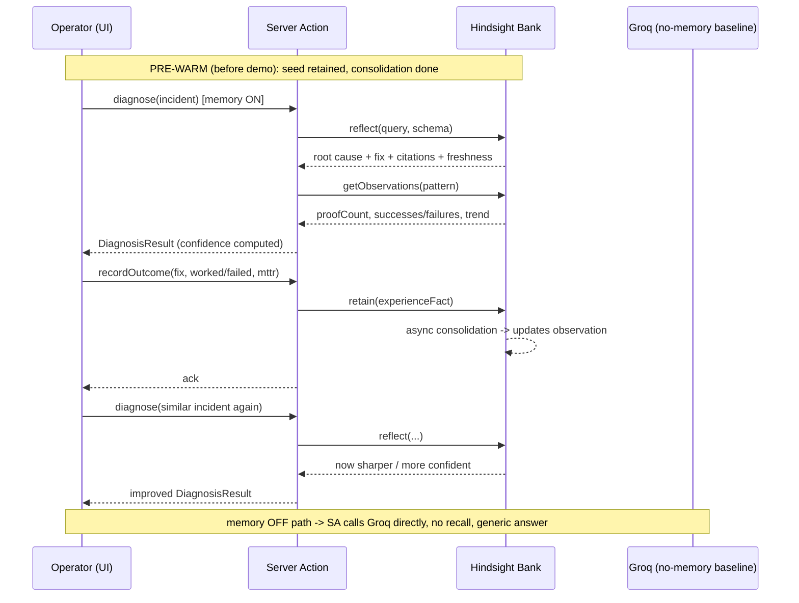

# Aftermath — Detailed Solution

**Companion to `aftermath-project-brief.md`. This document is the deep "how it actually works" — the cognitive model, the memory mapping, the data contracts, the reasoning mechanics, the confidence math, the orchestration, and how every piece produces a demo beat.**

---

## 0. The One Idea Everything Hangs On

Most incident tools treat memory as a **lookup**: store text, search text, paste into a prompt. Aftermath treats memory as **cognition**: the system forms beliefs from experience, tracks whether those beliefs still hold, learns from its own failures, and gets measurably better over time without retraining.

The entire solution is one loop, run over and over:

> **Diagnose → Act → Record → Consolidate → (next incident is sharper)**

Call it the **DARC loop**. Hindsight provides the hard parts (reasoning with citations, automatic consolidation, freshness tracking); Aftermath wires them into this loop and makes the learning *visible*.

---

## 1. The Cognitive Model (DARC)

| Step | What happens | Hindsight primitive | Output |
|---|---|---|---|
| **Diagnose** | Given a new symptom, reason over past incidents to propose root cause + safest mitigation, with cited evidence and a confidence score | `reflect()` | A `DiagnosisResult` |
| **Act** | A human operator applies (or rejects) the recommended fix and observes the result | — (human in the loop) | `worked` / `failed` |
| **Record** | The outcome is written back to memory as a first-person Experience Fact | `retain()` | A new memory |
| **Consolidate** | Hindsight merges the new outcome into long-term patterns, updating proof counts and freshness | Observation Consolidation (automatic, async) | Updated `Observation` |

The loop's value compounds: each pass makes the next **Diagnose** faster, better-grounded, and more honestly scored.

---

## 2. Memory Model — Incident Concepts Mapped to Hindsight

Aftermath uses all four of Hindsight's knowledge layers deliberately:

| Hindsight construct | In Aftermath it represents | Example |
|---|---|---|
| **World Fact** | Objective infrastructure facts | "The ingress migrated from NGINX to Envoy on 2026-05-15." |
| **Experience Fact** | The agent's own diagnoses and their outcomes — the core of the system | "I recommended shedding at the legacy gateway; it FAILED post-migration." |
| **Observation** (auto-consolidated) | A learned pattern across many incidents, with proof count + freshness | "Shed-at-legacy-gateway resolves Auth 429 cascades — *weakening* since the Envoy migration." |
| **Mental Model** (optional, curated) | A hand-pinned playbook for a top recurring incident, checked first | "Auth surge runbook: shed at Envoy, warm cache, jittered backoff." |

**Why Experience Facts are the heart of it:** a system that only stores World Facts is a wiki. A system that stores *its own actions and their outcomes* — including failures — is an agent that learns from experience (the ExpeL insight from the brief). This is the single most important modeling decision.

**Freshness is a first-class signal.** Every Observation carries a trend: `stable | strengthening | weakening | stale` plus a proof count. Aftermath reads this and changes its behavior accordingly (see §6 and §7).

---

## 3. Bank Configuration (set once, ~20 min)

The bank is configured to behave like a cautious senior SRE. Each setting has a purpose; do not treat these as decoration — they are visible, defensible design choices.

```
reflect_mission:
  "I am the on-call SRE memory for our platform. I prioritize fast, SAFE mitigations that
   are grounded in what has actually worked before. I distrust fixes that have recently
   started failing, and I never hide uncertainty."

retain_mission:
  "Extract the symptom, root cause, the exact fix attempted, and whether it worked or
   failed, with the date and time-to-resolution."

observations_mission:
  "Consolidate incidents by symptom pattern and by mitigation. Track how often each
   mitigation succeeds vs fails and whether its reliability is changing over time."

disposition:
  skepticism = 4   # questions whether an old fix still applies
  literalism = 5   # precise about exact symptoms and configs
  empathy    = 2   # facts over feelings; this is ops

directives:         # hard rules, enforced on every reflect()
  - "Always cite the past incident IDs that support a recommendation."
  - "If a recommended mitigation has any FAILURE in its supporting evidence, surface the
     failure and explain when/why it failed."
  - "If the supporting observation is marked 'weakening' or 'stale', warn explicitly and
     recommend verification before applying."
  - "If there is no prior incident similar to the symptom, say so and mark the
     recommendation UNVERIFIED."
```

Disposition presets in Hindsight's docs put Code Review / Legal at high skepticism + high literalism — incident response belongs in the same family. We borrow that profile.

---

## 4. Data Contracts (TypeScript)

These are the shared types every layer builds against. Centralize them in `lib/types.ts`. The brief's canonical incident shape is the six core fields; the rest are runtime types.

```typescript
// Stored incident (matches seed schema)
export type Outcome = 'success' | 'failure';

export interface IncidentRecord {
  id: string;               // "INC-001"
  service: string;
  symptom: string;
  root_cause: string;
  fix: string;
  outcome: Outcome;
  mttr_minutes: number;
  date: string;             // ISO yyyy-mm-dd
  lesson?: string;
  tags?: string[];
  retain_text: string;      // first-person Experience Fact (feed THIS to retain)
}

// What the agent returns for a new incident
export interface DiagnosisResult {
  rootCause: string;
  recommendedFix: string;
  avoid: string[];                       // fixes that failed before — "do NOT do X"
  supportingIncidentIds: string[];       // citations
  confidence: number;                    // 0–100
  confidenceBand: 'high' | 'medium' | 'low';
  freshnessWarning: string | null;       // set when evidence is weakening/stale
  verified: boolean;                     // false => novel/unverified
  evidence: EvidenceItem[];              // for the citation panel
  rationale: string;                     // human-readable "why"
}

export interface EvidenceItem {
  incidentId: string;
  date: string;
  outcome: Outcome;
  freshness?: 'stable' | 'strengthening' | 'weakening' | 'stale';
  snippet: string;
}

// A new incident the operator is triaging
export interface IncidentInput {
  service: string;
  symptom: string;
}

// Outcome the operator records after acting
export interface OutcomeReport {
  incidentInput: IncidentInput;
  appliedFix: string;
  outcome: Outcome;
  mttrMinutes: number;
}
```

---

## 5. The Integration Seam — `HindsightClient` Adapter

Everything that touches Hindsight goes through one interface. This is what keeps the build integrable: the UI and agent logic depend on the **interface**, never the SDK. A `MockHindsightClient` lets the frontend run before the real memory layer is wired, and lets the demo survive a flaky network.

```typescript
// lib/memory/HindsightClient.ts
export interface HindsightClient {
  // store a first-person Experience Fact (or World Fact)
  retain(text: string, meta?: Record<string, unknown>): Promise<{ id: string }>;

  // raw multi-strategy search (semantic/keyword/graph/temporal)
  recall(query: string, opts?: { limit?: number }): Promise<RecalledMemory[]>;

  // agentic reasoning with disposition + directives + structured output
  reflect(input: {
    query: string;
    responseSchema?: object;          // -> structured_output
    includeToolCalls?: boolean;
  }): Promise<ReflectResult>;

  // read consolidated patterns (proof count + freshness) for the UI
  getObservations(query: string): Promise<ObservationView[]>;
}

export interface ReflectResult {
  text: string;
  structuredOutput?: any;             // parsed against responseSchema
  basedOn: {
    memories: { id: string; text: string; type: string }[];
    mentalModels: { id: string; text: string }[];
    directives: { id: string; name: string }[];
  };
}

export interface ObservationView {
  id: string;
  belief: string;                     // "shed-at-legacy-gateway resolves Auth 429"
  proofCount: number;
  successes: number;
  failures: number;
  freshness: 'stable' | 'strengthening' | 'weakening' | 'stale';
  lastEvidenceDate: string;
}
```

> Implementation note: the **real** adapter wraps the Hindsight TypeScript SDK (`/sdks/nodejs`). Confirm exact SDK method names there; do not guess them in feature code — keep them isolated inside `RealHindsightClient`. The **mock** returns canned `DiagnosisResult`s derived from the seed file.

---

## 6. Operation Deep-Dives

### 6.1 Retain — what we store and how

Every resolved (or failed) incident becomes an **Experience Fact**, retained verbatim from the seed's `retain_text` (consistent phrasing → cleaner consolidation). At demo time, when the operator records an outcome, we compose the same first-person shape:

```typescript
function composeRetainText(o: OutcomeReport): string {
  const verb = o.outcome === 'success' ? 'SUCCESS' : 'FAILURE';
  return `On ${today()} the ${o.incidentInput.service} showed: ${o.incidentInput.symptom}. ` +
         `I applied: ${o.appliedFix}. Outcome: ${verb}, resolved in ${o.mttrMinutes} minutes.`;
}
```

Storing **failures** is non-optional — that is what powers the "avoid" list and the weakening signal.

### 6.2 Diagnose — the reflect() call

Diagnosis is a single `reflect()` with a structured-output schema. The directives (from §3) force citations, failure-surfacing, and weakening warnings; the schema gives us clean fields for the UI.

```typescript
const DIAGNOSIS_SCHEMA = {
  type: 'object',
  required: ['root_cause', 'recommended_fix', 'supporting_incident_ids', 'verified'],
  properties: {
    root_cause:              { type: 'string' },
    recommended_fix:         { type: 'string' },
    avoid:                   { type: 'array', items: { type: 'string' } },
    supporting_incident_ids: { type: 'array', items: { type: 'string' } },
    freshness_warning:       { type: ['string', 'null'] },
    verified:                { type: 'boolean' },
    rationale:               { type: 'string' },
  },
};

const result = await memory.reflect({
  query:
    `New incident on ${input.service}: "${input.symptom}". ` +
    `Based on past incidents, what is the most likely root cause and the SAFEST ` +
    `recommended mitigation? Cite the supporting incident IDs. List any fixes that ` +
    `failed for this pattern under "avoid". If the supporting evidence is weakening ` +
    `or stale, set freshness_warning. If no similar incident exists, set verified=false.`,
  responseSchema: DIAGNOSIS_SCHEMA,
  includeToolCalls: true,
});
```

The agent's hierarchical retrieval (mental models → observations → raw facts) and TEMPR's temporal strategy mean "since the migration" and "recently" actually resolve correctly — this is why the weakening story works at all.

### 6.3 Confidence — grounded, not hallucinated

Confidence is computed by Aftermath from memory metadata, **not** asked of the LLM. This is a key differentiator: the number is defensible and tied to evidence.

```
Let  n  = number of supporting prior incidents (proof count)
     s  = successes among them,  f = failures among them
     successRatio   = s / (s + f)                       // 0..1
     evidenceFactor = min(1, n / 3)                     // 3+ incidents = full weight
     freshnessFactor= { stable: 1.0, strengthening: 1.0,
                        weakening: 0.5, stale: 0.6 }[trend]
     recencyFactor  = clamp(1 - daysSinceLastEvidence / 90, 0.4, 1.0)

confidence (0..100) = round(100 * successRatio * evidenceFactor
                                  * freshnessFactor * recencyFactor)

band: >=70 high · 40–69 medium · <40 low
verified = (n >= 1); if n == 0 -> confidence forced low, band low, UNVERIFIED
```

Worked example (the weakening beat): Auth 429 has n=6, s=4, f=2 → successRatio 0.67; evidenceFactor 1.0; trend `weakening` → 0.5; last evidence 4 days ago → recency ~0.96. Confidence ≈ `100 * 0.67 * 1.0 * 0.5 * 0.96 ≈ 32` → **LOW**, with a freshness warning. Before the migration (n=4, s=4, f=0, stable) it would have been ≈ **96 (HIGH)**. That visible collapse from 96 → 32 *is* the demo.

### 6.4 Freshness handling

When `getObservations()` returns a matched pattern with `freshness ∈ {weakening, stale}`, Aftermath:
1. lowers confidence (via `freshnessFactor`),
2. populates `freshnessWarning` ("This mitigation has failed twice since the 2026-05-15 migration — verify before applying"),
3. renders a colored badge on the evidence panel,
4. (if a newer successful alternative exists in memory) recommends that instead.

---

## 7. The Closed Learning Loop (runtime sequence)



The **memory ON/OFF toggle** is implemented as two branches in the same server action: ON → `reflect()` over the bank; OFF → a raw Groq completion with only the symptom and no retrieved context. Same input, two outputs — the before/after the judges score.

---

## 8. Orchestration — Server Actions

Three server actions, thin, all going through the adapter:

```typescript
// app/actions.ts  (Next.js server actions = our backend)

export async function diagnoseIncident(
  input: IncidentInput,
  useMemory: boolean
): Promise<DiagnosisResult> {
  if (!useMemory) return baselineDiagnosis(input);          // Groq, no memory
  const reflect = await memory.reflect({ query: buildQuery(input), responseSchema: DIAGNOSIS_SCHEMA });
  const obs = await memory.getObservations(input.symptom);
  return assembleResult(reflect, obs);                      // computes confidence here
}

export async function recordOutcome(o: OutcomeReport): Promise<{ ok: true }> {
  await memory.retain(composeRetainText(o), { service: o.incidentInput.service, outcome: o.outcome });
  return { ok: true };                                      // consolidation happens async in Hindsight
}

export async function getMemoryState(pattern: string): Promise<ObservationView[]> {
  return memory.getObservations(pattern);                   // drives the freshness panel + MTTR trend
}
```

`baselineDiagnosis()` deliberately has **no** retrieval — it is the dumb control that makes the toggle dramatic.

---

## 9. Frontend Architecture

Single screen, four zones. Keep it clean; this is where the score is won or lost.

| Zone | Component | Shows |
|---|---|---|
| **Input** | `IncidentForm` | service + symptom; "Diagnose" button; the **Memory ON/OFF toggle** |
| **Diagnosis** | `DiagnosisCard` | root cause, recommended fix, the **confidence band**, the `avoid` list, and the `freshnessWarning` banner |
| **Evidence** | `EvidencePanel` | cited incidents with date + outcome + **freshness badge** (the "show your work") |
| **Impact** | `ImpactBar` | live **MTTR clock** and **cost counter** (Recharts); trend across past incidents |

State is local React state (no browser storage). Data flows: form → `diagnoseIncident` → `DiagnosisResult` into the cards; "record outcome" → `recordOutcome` → optional refetch of `getMemoryState`.

**Cost counter math (for business judges):** `cost = mttr_minutes * costPerMinute` with a configurable `costPerMinute` (e.g. ₹X/min of downtime). Display the delta between the no-memory MTTR and the memory MTTR as "saved".

---

## 10. How Each Demo Beat Is Produced (mechanics → moment)

| Demo beat | The mechanic that produces it |
|---|---|
| **Cold open (memory OFF)** | `diagnoseIncident(input, useMemory=false)` → `baselineDiagnosis` → generic Groq answer, no citations, no confidence |
| **Flip ON** | same input, `useMemory=true` → `reflect()` returns cited root cause + fix; confidence computed HIGH; MTTR/cost drop |
| **Failure avoidance** | INC-003 (restart, failure) + INC-004 (real fix, success) in memory → `avoid: ["restart the pods"]`, recommends the cache fix |
| **Weakening** | INC-005…010 → observation `weakening`; confidence collapses 96→32; `freshnessWarning` banner + badge |
| **Live learning** | operator records a fresh outcome via `recordOutcome` → re-run a similar diagnosis → improved/more confident result |

---

## 11. Edge Cases & Failure Handling

- **Novel incident (no evidence):** `reflect` sets `verified=false`; confidence forced LOW; UI shows "No prior incident — treating as novel, UNVERIFIED."
- **Conflicting evidence (same fix, mixed outcomes):** surface both, lower confidence via `successRatio`, recommend the successful variant and warn.
- **Hindsight unavailable / rate-limited:** adapter catches and falls back to `MockHindsightClient` (canned from seed) so the demo never hard-fails. Log loudly, degrade gracefully.
- **Consolidation not yet run:** never rely on live consolidation; pre-warm. If an observation is missing at runtime, fall back to raw `recall()` over experience facts.
- **Groq function-calling error:** retry once, then fall back to `qwen/qwen3-32b`.

---

## 12. What's Real vs Faked (honest scope)

**Real:** the memory layer (Hindsight), the reasoning (Groq via `reflect`), the learning loop, confidence from real metadata, freshness from real consolidation.

**Faked/Simulated (and that's fine):** the "infrastructure." There is no live monitoring feed — incidents are entered manually or replayed from the seed, and outcomes are marked by a human. The intelligence is real; the plumbing around it is staged. *Fake the infrastructure, make the learning real.*

---

## 13. Glossary

- **DARC loop** — Diagnose → Act → Record → Consolidate; Aftermath's core cycle.
- **Experience Fact** — a memory of the agent's own action and its outcome; the basis of learning.
- **Observation** — an auto-consolidated belief across many memories, with a proof count and freshness trend.
- **Freshness trend** — `stable | strengthening | weakening | stale`; how reliable a belief currently is.
- **TEMPR** — Hindsight's 4-way retrieval (semantic, keyword, graph, temporal).
- **Reflect** — Hindsight's agentic reasoning loop that returns a disposition-shaped, cited answer.
- **Mental Model** — a pinned, human-curated playbook checked before observations and raw facts.
